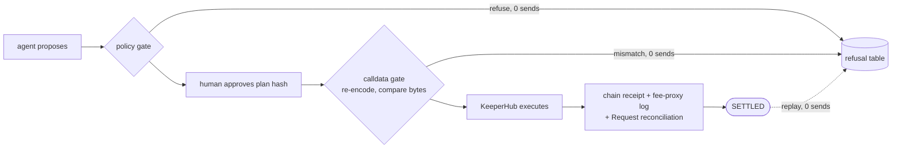

# ReqKeeper

**Exactly-once settlement of Request Network obligations through KeeperHub.**

An agent retries. When the thing being retried moves money, the retry is a second payment, and no
layer owns the problem: the agent framework re-runs the tool, the payment rail leaves duplicate
semantics unspecified, and KeeperHub's replay cache forgets the key after 24 hours and executes again.

ReqKeeper puts obligation identity where it outlives all of that. The Request invoice is the key.
An agent may propose; only a human approves; the approved calldata is re-encoded locally and
compared byte for byte before anything is sent.

Proof: 38 real payments on Sepolia, 38 replays refused at zero sends, 45 live refusals before any
provider write. Every row re-derives from a public RPC with no credentials. The token is **FAU, a
Sepolia faucet token anyone can mint for free**: real bytes, real receipts, an asset worth nothing.
That is what makes it reproducible by a stranger rather than a claim you have to take on trust.



**Demo video:** [`docs/demo.mp4`](docs/demo.mp4) · **Console:** [`web/index.html`](web/index.html)

**Who this is for:** payers that cannot be a smart account — a custodial or relayed EOA (here, a
KeeperHub Turnkey wallet) whose agent must not pay the same invoice twice. **Not for you if** your
payer can be an [ERC-7710 delegator smart account](https://docs.metamask.io/delegation-toolkit/concepts/delegation/caveat-enforcers/):
use MetaMask's on-chain enforcers, which are strictly better. Next section says why.

- **Integrated project:** [Request Network](https://request.network) — invoices on Ethereum Sepolia
- **Execution:** two KeeperHub surfaces behind one interface, direct execution and its own MCP
  server, plus the audit trail. **Evidence:** [`docs/refusals-live.json`](docs/refusals-live.json), all 83 rows.
- **Network:** Ethereum Sepolia (11155111). Mainnet is disabled in code.
- **Cost to run:** $0, no card. `src/` and `scripts/` have zero dependencies; only the one-time
  invoice creation in `tools/invoice/` uses the official Request SDK, which is why it is separate.
- **Credentials needed:** one KeeperHub API key. No Request Client ID — see below.

## Prior art, and the honest delta

**MetaMask's Delegation Framework already ships both of these gates on-chain, which is better than
what is here.** [`IdEnforcer.sol`](https://github.com/MetaMask/delegation-framework/tree/main/src/enforcers)
keeps a BitMap of used ids and reverts `IdEnforcer:id-already-used`; `ExactCalldataEnforcer.sol`
reverts unless `keccak256(termsCallData_) == keccak256(callData_)`. The chain enforces both and no
operator can skip them.

The delta is the payer. Here it is a KeeperHub Turnkey EOA executing through a relayer/forwarder —
no delegator smart account to attach a caveat to, and no per-obligation on-chain provisioning
transaction to attach it in. Both enforcers are unavailable, so both gates are rebuilt off-chain in
front of dispatch, where they are weaker and have to earn trust by being reproducible. KeeperHub
wrote this thesis themselves in March 2026 — ["The signers saw a routine transfer. What they
actually signed was a `delegatecall` to a malicious contract"](https://keeperhub.com/blog/003-bybit-attack-caught-by-wrong-people)
— and prescribed monitoring. An alert is a race. A byte comparison before dispatch is not.

## Nobody owns the duplicate

Duplicate payments are not a hypothesis. They are a recurring, expensive, well-documented failure
of systems with far more process around them than an agent has:

| Where | What a broken duplicate guard cost |
|---|---|
| [ICON Network, 27 Aug 2026](https://www.icon.foundation/blog/2026/icon-network-replay-exploit-post-mortem) | Two signed withdrawal messages replayed **1,492 times**, 1,490 successfully, releasing **119,866,000 ICX**. Root cause, verbatim: "the uniqueness check (the guard meant to stop a message from being processed twice) only validated the high bits of the serial number." |
| [City of Richmond auditor, 11 May 2026](https://rva.gov/sites/default/files/2026-05/OCA%202026-09%20Continuous%20Monitoring%20-%20Duplicate%20Payments%205.11.26.pdf) | **50 duplicates, $5,759,563.64**, the largest a single **$5,092,722.08 wire processed twice**. Three duplicates that were voided got automatically reissued the same day. |
| [UK Cabinet Office, National Fraud Initiative 2022-24](https://www.gov.uk/government/publications/national-fraud-initiative-reports/national-fraud-initiative-report-2022-2024-html) | **819 duplicate payments worth £11m** across public bodies. |
| [`x402#1805`](https://github.com/x402-foundation/x402/issues/1805) | 5 concurrent requests, **4 got the same settlement proof**; duplicate debits refunded after the fact. |

The defence is always a key with a window on it, and the window is always shorter than the
obligation. KeeperHub's docs: idempotency "replay lasts 24 hours… Past that the stored response is
gone and **the same key executes again, silently**". [Stripe's](https://docs.stripe.com/api/idempotent_requests)
says the same — keys "may be pruned after 24 hours". An industry pattern, not one vendor's bug,
which is why obligation identity has to outlive the cache rather than live inside it. KeeperHub
owns reliability *within* a run; nothing owns obligation identity *across* runs. That is the gap.

**No AI agent has done this in public yet**, and the honest claim is the inverse: agents are kept
away from accounts payable *because* nothing at this seam can prove exactly-once. Only
[20% of executives](https://www.pwc.com/us/en/tech-effect/ai-analytics/ai-agent-survey.html) would
trust an agent with a financial transaction; on the [Finch benchmark](https://arxiv.org/abs/2512.13168)
the best model passes 38.4% of finance workflows. The guarantee has to exist before an agent is
handed the key, not after the first incident.

## Why Request Network specifically

**The invoice is the idempotency key.** Every Request invoice carries a canonical request id
and a 16-character payment reference embedded in the calldata. That is a stable obligation
identity issued by an external system — it survives a payer wallet change, an API key
rotation, a re-import, regenerated calldata, and the 24-hour replay expiry.

We did not invent an identity scheme. Request already ships one.

And the loop closes without fabrication. `SETTLED` requires **two independent reads**: an
`eth_getTransactionReceipt`, and the ERC20FeeProxy event log carrying the payment reference — the
same log Request's own detection reads. A provider status string is never sufficient for either.
The settle path does not call Request's API at all, it reads the chain evidence that API derives
from; `tools/invoice/check-paid.mjs` asks Request directly and confirmed `hasBeenPaid: true`, but
that is a separate check, not the gate.

## The approved bytes are not the signed bytes

This has a name and a standard, and this project did not discover it. The Ethereum Foundation calls
it [a structural flaw "that has contributed to billions in user losses, including the Bybit
hack"](https://blog.ethereum.org/2026/05/12/clear-signing-announcement) and sets "What You See Is
What You Sign" (WYSIWYS) as the goal; [ERC-7730](https://eips.ethereum.org/EIPS/erc-7730)
standardises the metadata; [arXiv 2606.02668](https://arxiv.org/abs/2606.02668) carries WYSIWYS
into the agent approval channel; Checkmarx demonstrated it as [RCE through a forged approval
dialog](https://checkmarx.com/zero-post/bypassing-ai-agent-defenses-with-lies-in-the-loop/); and
Vercel's AI SDK shipped a fix without naming the problem —
[`experimental_toolApprovalSecret`](https://ai-sdk.dev/docs/agents/tool-approvals), a "signature
[that] binds the approval to the exact tool name, tool call ID, and input arguments".

**Clear signing does not catch this case, and that gap is the contribution.** It assumes the human
reads the fields correctly and the *display* is what is under attack. Here the encoder is
downstream of the display: KeeperHub re-encodes server-side from `(contractAddress, functionName,
functionArgs)`, so nothing the human saw is what gets signed. Rendering the right thing at the
human cannot fix an encoder that runs after them; the check has to sit after the human and before
the signer, on bytes. Nor have the standards bodies covered it — OWASP's LLM06 never mentions
approval-versus-execution divergence, and its agentic threat list carried the human channel as T10
before deleting it as "primarily a vulnerability in the human-computer interaction (HCI) and
operational process layer".

The concrete instance below was found by probing the live API. Request Network hands you **finished
calldata**: `GET /request/{id}/pay` returns `{to, data, value}`, fully encoded, reference embedded.

KeeperHub will not send finished calldata. Probed on 2026-09-09, with the refusals printed
verbatim by `npm run verify:seam`:

```
contract-call, data      -> HTTP 400 {"error":"Missing required field","field":"functionName"}
contract-call, callData   -> HTTP 400 {"error":"Missing required field","field":"functionName"}
raw route                 -> HTTP 400 {"error":"Invalid action type: raw"}
transaction route         -> HTTP 400 {"error":"Invalid action type: transaction"}
```

The only write surface is `(contractAddress, functionName, functionArgs)`, and KeeperHub re-encodes
it against an ABI **it** resolves, using ethers 6.17.0. So between "the human approved these bytes"
and "the signer signed these bytes" there is a decode step, a transport, and a re-encode performed
by the execution platform on an ABI nobody in the approval loop saw. Not a hypothetical: it is the
ordinary path for paying a Request invoice through KeeperHub, invisible unless you go looking.

**What ReqKeeper does about it.** [`src/abi.ts`](src/abi.ts) decodes the approved calldata and
re-encodes it locally; the arguments are dispatched only if the re-encode is byte-identical to
what was approved. Anything else refuses, non-retryably, before a single network call:

| Smuggled variant | Refusal |
|---|---|
| trailing bytes appended after the arguments | `calldata_mismatch` |
| a selector that is not on the allowlist | `selector_not_allowed` |
| dirty high bytes packed above an address | `calldata_mismatch` |

The codec is deliberately tiny and refuses every type it does not implement: one that silently
mis-encodes an argument is worse than none, because it breaks the byte-comparison that was the
safety net. `npm test` checks it against **KeeperHub's own encoder output**, captured byte-for-byte
from a live simulate's revert payload. Two implementations, same 260 bytes.

### And the `to` address is not the contract you named either

Reading a real executed transaction back off the chain shows a second layer. Asking KeeperHub to
call `mint` on FAU produced tx
[`0x5b722787…`](https://sepolia.etherscan.io/tx/0x5b722787ce6523d7d0d7094a4d82159809c06a395bf990bce90b107712040a74)
(Sepolia block 11664587), and what actually got signed was:

| Field | Value | What was approved |
|---|---|---|
| `tx.from` | `0x809d8252…` | — a KeeperHub relayer, not the payer |
| `tx.to` | `0x5af5194b…` (3963-byte contract) | FAU, `0x370DE27f…` |
| selector | `0x9aefaff8` on the forwarder | `0x40c10f19` — `mint(address,uint256)` |
| gas payer | the relayer, 0.000119 ETH | — |

The named call survives only as an *inner payload*: a 65-byte ECDSA signature followed by
`0x40c10f19` and its arguments, relayed to a forwarder. `(to, data)` as approved never appears in a
transaction anywhere; only the `Transfer(0x0 → payer, 100e18)` log proves the call happened.

Two consequences, both measured rather than assumed. **Gas is sponsored on Sepolia** — no funded
payer wallet, no faucet ETH, is a precondition for a contract call. And **`msg.sender` is still the
payer**: after an `approve`, `allowance(payer → ERC20FeeProxy)` reads `100e18` on-chain while
`allowance(forwarder → proxy)` stays `0`. Had it been the other way round, a Request payment could
never settle through this route at all.

## What another team should look at first

Six files, in the order that explains the design — [`src/identity.ts`](src/identity.ts) (the three
identities, all derived from persisted state: no clock, no randomness, no generated text ever
enters a key), [`src/money.ts`](src/money.ts) (exact fixed-point, throws rather than truncating),
[`src/abi.ts`](src/abi.ts) (the calldata gate, verified against ethers 6.17.0),
[`src/settle.ts`](src/settle.ts) (**the order of checks is the safety property**),
[`src/store.ts`](src/store.ts) (outbox, leases, fencing), and
[`scripts/harness.ts`](scripts/harness.ts) — the refusal table, which is the deliverable. Full map
at the bottom.

## Run it

Needs Node 24+. Nothing else — no `npm install`, no `node_modules`.

```bash
npm run gate-a            # the make-or-break gate: does this integration exist end to end?
npm test                  # 239 unit tests
npm run harness           # 26 cases, 24 of them refusals -> docs/refusals.json
npm run verify:onchain    # reads Sepolia via public RPC, no credentials
npm run verify:seam       # proves the calldata gate against the live API (needs the KeeperHub key)
npm run verify:mcp        # the same, through KeeperHub's own MCP server
npm run harness:live      # the refusal table against real invoices -> docs/refusals-live.json
npm run verify:live       # re-derives every live row from a public RPC, no credentials
npm run settle:live       # settles one real Request obligation; run twice to see the refusal
npm run resolve           # drains the outbox: reads chain receipts and the fee-proxy log to
                          #   finish obligations left pending. No write path to the provider,
                          #   so the worst a bug in it can do is fail to advance one.
```

`gate-a` is the gate this project was allowed to fail at: it walks the whole integration, chain up
to a landed payment. Current result: **10 ok, 0 failed, 2 blocked.** Both blocked steps are
Request's hosted REST convenience API, which nothing here depends on — invoices are raised through
the unauthenticated protocol gateway (step 3, ok) and calldata is encoded locally.

`verify:onchain` needs no wallet, account or API key: it confirms every address, selector and
decimals figure this build depends on straight from Sepolia. Worth running first — a widely
repeated answer online gives Request's ERC20FeeProxy as `0x370DE27f…`, which is actually the FAU
**token**. Both are deployed, they are different contracts, and this script says so.

## Live on Sepolia: one obligation, paid once

A real Request invoice, paid through KeeperHub by the same `settle()` that produces the 24
refusals. `npm run settle:live` reproduces it; running it **twice** is the point.

```
requestId        : 011a5eca74adfa1e61276d5d3b3c41339c2daddaaa406b6f1b7344c2a4679a2403
paymentReference : 0x3ad3fe6653fb8827
obligationId     : 3a79273eb6cab086a787cf5bbee3864982acda2e61b44875fdc6562e6e662f8d
```

| Run | State | Refusal | Provider write | Tx |
|---|---|---|---|---|
| **1st** | `SETTLED` | — | `true` | [`0x134f352d…`](https://sepolia.etherscan.io/tx/0x134f352dc69843105a01d1b9d6cc9799b660bd28e08920144bb67cb3852bfeff) |
| **2nd** | `SETTLED` | `ALREADY_SETTLED` | **`false`** | *nothing sent* |

> `obligation is already SETTLED; nothing to do and nothing sent`

The second run is the entire product. Same obligation, same approved plan, a fresh process, and
no second payment.

Duplicate protection is layered, refusing at different distances from the money:

| Guard | Fires when | Refusal |
|---|---|---|
| terminal-state check | the obligation already settled | `ALREADY_SETTLED` — refuses before a plan is even built |
| `UNIQUE(plan_hash, step_index)` + `firstSendAt` | a plan's step was already sent but the outcome is unresolved | `ALREADY_DISPATCHED` — harness case C25 |
| `reserved_by_plan`, claimed inside `BEGIN IMMEDIATE` | a rival plan holds the same obligation | `OBLIGATION_RESERVED` |

All three live in the local store, so all three outlive the provider's 24-hour idempotency window
rather than depending on it.

**The approval sentence a human actually signed off**, from the same values as the calldata at the
same moment:

> Pay 1 FAU to 0xc43d766cb7c48b9b198db87441b97c09e81717a1 on chain 11155111, plus 0 fee.
> Total leaving the wallet: 1 FAU (1000000000000000000 base units).

**Three independent confirmations**, because a provider's status string is never evidence:

| Source | Says |
|---|---|
| `eth_getTransactionReceipt` | `success`, `verified=true`, `gasUsed=74618` |
| ERC20FeeProxy event log | reference `0x3ad3fe6653fb8827` for exactly `1000000000000000000` |
| Request Network's own detection | `balance: 1000000000000000000`, 1 payment event, `hasBeenPaid: true` |

Setup executions, also live and also verified by reading the chain:

| What | Transaction | Verified by |
|---|---|---|
| mint 100 FAU to the payer | [`0x5b722787…`](https://sepolia.etherscan.io/tx/0x5b722787ce6523d7d0d7094a4d82159809c06a395bf990bce90b107712040a74) | `Transfer(0x0 → payer, 100e18)`, block 11664587 |
| approve ERC20FeeProxy | [`0x0e6b631a…`](https://sepolia.etherscan.io/tx/0x0e6b631ad0071e33c1d94601cbbafa4f0f0ac5d64926f84043c71bf148b88d61) | `allowance(payer → proxy)` reads `100e18` |

Payer: [`0x027D54A6…`](https://sepolia.etherscan.io/address/0x027D54A692e0e80173141777BdB847c1726FA1F3)
— KeeperHub's own Turnkey wallet, not a browser wallet.

### No Request Client ID was used

Only Request's v2 REST API requires one. The protocol does not —
`sepolia.gateway.request.network` accepts `persistTransaction` unauthenticated — so
[`tools/invoice/`](tools/invoice/) creates the invoice there with a burner keypair. **One**
credential total: the KeeperHub API key.

## The agent surface, and the one thing it cannot do

[`src/mcp.ts`](src/mcp.ts) is an MCP server over stdio. Six tools:

| Tool | What an agent can do |
|---|---|
| `propose_payment` | build a plan, get back the sentence a human must read. Never dispatches. |
| `settle_obligation` | settle an obligation a human already approved. Cannot pay twice. |
| `obligation_status` | state and full audit trail |
| `verify_payment` | confirm a payment from the chain, without asking the provider |
| `resolve_pending` | close out a payment already sent but not yet confirmed. No send path at all. |
| `refusal_codes` | the refusal vocabulary, each with do-not-retry guidance |

**There is no approve tool** — not disabled, not permission-flagged, absent from the protocol
surface. No sequence of calls authorises money to move. On the agent path approval is written only
by [`scripts/approve.ts`](scripts/approve.ts), a human CLI the server neither exposes nor can
invoke. (The two live *scripts*, `settle-live.ts` and `live-harness.ts`, self-approve inline: that
is the owner driving their own wallet non-interactively, and no agent can reach that path.)

`test/mcp.test.ts` asserts the absence, including that the handler refuses `approve`,
`approve_payment`, `record_approval`, `authorize` and `sign_plan` if a client guesses at them,
and that 25 `settle_obligation` calls before a human decides yield `totalSends() === 0`.

And the approval CLI does not accept a plan hash. It **recomputes** one from the invoice
facts you type and compares it against the plan the agent actually reserved:

Approving an obligation that a *different* proposal has already reserved:

```
REFUSED: the plan reserved for this obligation is not the plan these arguments describe.
  reserved by : be7830f4d60c3e9f9a409faf680d51840a93ff8a55922a4e72a9470c3d0a579b
  you typed   : 7fbdadaff7d772ad7f73659f15bce30eb94b03a3b383cb9bdeeeaa34bd76e032

Something proposed a different payment than the one you are approving. Investigate
before recording any decision.
```

Type an amount nothing ever proposed — 5 FAU against a 1 FAU plan — and it refuses one step
earlier, with `no such plan locally`: your numbers hash to a plan that does not exist. An approval
flow that trusts the proposer's own summary of what it proposed is not an approval flow. Hence the
invoice, not an id.

```jsonc
// register with any MCP client
{ "mcpServers": { "reqkeeper": { "command": "node",
    "args": ["--experimental-strip-types", "scripts/mcp-server.ts"], "cwd": "/path/to/reqkeeper" } } }
```

## 38 payments, 38 sends, 38 refused replays

Same protocol as the fixture harness, against real invoices on Sepolia. `npm run harness:live`
creates real Request invoices, settles each through KeeperHub, then dispatches the same obligation
a second time. Sends are counted by wrapping the provider, so a zero is a number this code observed
rather than a status string it believed.

83 rows, all as specified. **None of it has to be taken on trust:** `npm run verify:live`
re-derives every row from a public RPC with no credentials and reports the claim as arithmetic:

```
38/38 receipts verified as successful on chain
2835088 gas used in total across them
38/38 references present on chain
38 of them for exactly 1000000000000000000 base units
every refusal row reports zero sends, and carries no hash to check

  obligations settled          38
  replays attempted            38
  sends made by those replays  0
```

Full rows, with every transaction hash and payment reference, in
[`docs/refusals-live.json`](docs/refusals-live.json).

## Two KeeperHub surfaces, one protocol

`settle()` does not know which surface it dispatches through, and that is the point: a duplicate
guard whose safety depends on its transport is not a duplicate guard.

| Surface | Provider | Verified by |
|---|---|---|
| Direct execution REST (`/api/execute/contract-call`) | [`src/keeperhub.ts`](src/keeperhub.ts) | `npm run verify:seam` |
| KeeperHub's own MCP server (`https://app.keeperhub.com/mcp`, 44 tools) | [`src/keeperhub-mcp.ts`](src/keeperhub-mcp.ts) | `npm run verify:mcp` |
| Audit trail (`get_direct_execution_status` over MCP) | same | `npm run verify:mcp` |

The calldata gate is one module, [`src/calldata-gate.ts`](src/calldata-gate.ts), that both
providers call — two copies of that rule would be a hole in the exact defence this project exists
to provide. `npm test` covers both paths through it.

Two things about that MCP server that are easy to get wrong, both found by probing it:

- Authentication failure does not look like one. A rejected key still returns **HTTP 200** on
  `initialize`, just with no `mcp-session-id` header — its absence is the only reliable signal,
  because the 401 arrives on the *next* call. (The handshake is also sequential, and session ids
  silently rotate mid-flight, so the newest response wins.)
- `simulate` is compared with `=== true`. The string `"true"` does not dry-run: it signs and
  broadcasts.

## The refusal table

Generated by `npm run harness` into [`docs/refusals.json`](docs/refusals.json): 26 cases, 26 as
specified, **18 of 24 refusals happen before any provider write**. The provider counts *physical
sends*, so "0 gas burned" is a number, not an inference from a status string.

| Case | Scenario | Refusal | Sends |
|---|---|---|---|
| C01 | clean approved obligation | `SETTLED` | 1 |
| C02 | recipient not allowlisted | `PAYEE_NOT_ALLOWED` | 0 |
| C04 | invoice under cap that a **fee** pushes over | `LIMIT_EXCEEDED` | 0 |
| C07 | token decimals differ from policy | `TOKEN_DECIMALS_MISMATCH` | 0 |
| C12 | no human decision yet | `AWAITING_APPROVAL` | 0 |
| C14 | source facts changed after approval | `PLAN_CHANGED` | 0 |
| C15 | rival plan holds the obligation | `OBLIGATION_RESERVED` | 0 |
| C17 | cached failure replays forever (#1840) | `CACHED_FAILURE` | 0 |
| C19 | dry run actually executed (#1959) | `SIMULATE_EXECUTED` | 1 |
| C21 | provider claims success, chain has no receipt | `EVIDENCE_CONFLICT` | 1 |
| **C23** | **replay 25h later, settled, provider cache expired** | `ALREADY_SETTLED` | **1** |
| **C24** | **replay inside plan TTL, settled, cache expired** | `ALREADY_SETTLED` | **1** |
| **C25** | **replay inside plan TTL, outcome unconfirmed** | `ALREADY_DISPATCHED` | **1** |
| **C26** | **replay 25h later, outcome unconfirmed** | `ALREADY_DISPATCHED` | **1** |

C23 to C26 are the thesis: the send count does not move across a replay, whichever layer refuses.
The split is deliberate — C23/C24 settle first, so the terminal-state check refuses before a plan
is rebuilt; C25/C26 never reach `SETTLED` and fall through to the guards built for that case.
Without the unconfirmed pair, the terminal-state check would have silently shadowed both.

**C25 found a real bug in this codebase.** A plan inside its TTL whose provider idempotency cache
had lapsed re-entered dispatch, reused the same attempt row and called `execute()` again — and the
provider, having forgotten the key, paid twice. The guard is now on `firstSendAt`; C25 exists so it
cannot regress.

## Three platform hazards, modelled explicitly

Each is documented, money-critical, and has a fault injection in [`src/provider.ts`](src/provider.ts).

| Hazard | Source | Defence |
|---|---|---|
| Replay window expires at 24h, same key silently executes again | `docs.keeperhub.com/api/direct-execution` | `obligation_id` primary key + `UNIQUE(namespace, request_id)` + the `firstSendAt` guard, all outliving the provider cache |
| Reused key replays a **cached failure**, so retry can never succeed | issue #1840 | Distinguished from "unpaid". Requires a new approved plan — never a key rotation |
| `?simulate=true` is ignored and the transaction really executes | issues #1959 / #1929 | A dry run is not treated as a safety boundary. A tx hash returned from a simulate call is `EVIDENCE_CONFLICT` and treated as a real send |

### Retraction: #1959 did not reproduce

Probed live on 2026-09-09 against `POST /api/execute/transfer` with `simulate: true` from a
zero-balance wallet, the response was a correct dry run — `{"status":"simulated",
"wouldRevert":true,"code":"insufficient_balance","balanceWei":"0"}` — no hash, no execution. So
the hazard behind harness case `C19` is **modelled, not observed**. The check stays because a
returned hash would be unambiguous evidence of a real send, but the bug is not claimed to be live.
Stated rather than quietly dropped: an earlier note asserted it on the issue tracker alone.

## Honest limitations

1. **The policy gate is only as real as the operator's standing policy.** With
   `REQKEEPER_ALLOWED_PAYEES` and `REQKEEPER_MAX_DEBIT` unset — the default — every ceiling and
   allowlist comes *from the invoice itself*, so the gate can only catch facts that **change after
   approval**, not an invoice that was hostile to begin with. Set those two (see
   [`.env.example`](.env.example)) and it becomes a ceiling the invoice cannot raise;
   `describeStandingPolicy()` prints which of the two you are running.
2. **Duplicate protection is deployment-scoped.** It prevents a second successful payment of the
   same canonical Request obligation *through this deployment*. It cannot stop an independent
   wallet, another deployment, or a human paying the invoice out of band.
3. **No semantic dedup across request ids.** Two different Request ids may represent the same
   real-world invoice. Not detected.
4. **Revocation is not an onchain undo.** Already-broadcast work completes; cancellation only
   stops unsent actions.
5. **The audit trail detects tampering; it cannot prevent it.** Each row hash-chains to the one
   before, and `verifyAuditChain()` names the row where an edit or deletion breaks the chain. But
   an administrator holding the database can recompute the chain and produce a consistent forgery.
   Detection without an external anchor — not blockchain evidence.
6. **`simulate` is not treated as a safety boundary.** #1959 did not reproduce when probed
   (retraction above); the assertion stays, the platform bug is not claimed to be live.
7. **A restored older database can forget broadcasts** that happened after the backup.
   Restored environments must start with writes disabled pending reconciliation.
8. **Sepolia only.** Request supports no other testnet. Untested on mainnet, by design.
9. **No prompt-injection detection.** A guarded signer enforces a declarative policy. It does
   not detect injection, and does not claim to.
10. **Approval fatigue is real and not solved here.** Over 11,429 reviews in 7 months, approval
    rates drift 30.1% → 36.8% while inline comments fall 22% (p=0.0014, arXiv 2606.22721). This
    design reduces prompt *count*; it does not make a per-action queue safe.

**Configuration, not a limitation: quorum.** It defaults to 1 — one operator reviewing their own
proposal, labelled as such. Set it higher and `settle()` refuses until that many **distinct**
approvers have signed *this plan hash*; one person approving twice counts once. An agent credential
can never approve, at any quorum.

## What is not done

- **Some scenarios are still fixture, and have to be.** A lapsed 24-hour replay window, a cached
  provider failure, and a rival plan racing the same obligation are reproduced against
  `FixtureProvider` — provoking them for real means deliberately paying twice, or waiting a day per
  case. The refusal *logic* is the same code in both; only the fault injection differs.
- **The live settlement used a burner payee.** The payee is a keypair generated by
  `tools/invoice/`, not a counterparty. That is what makes it reproducible by a stranger, but it
  does mean no third party has confirmed receipt.
- **`Idempotency-Key` is accepted by KeeperHub but its behaviour is unconfirmed.** It is sent on
  every execution and not rejected; whether it deduplicates cannot be tested without deliberately
  paying twice. Which is why duplicate protection lives in this codebase's identity constraints
  and `firstSendAt` guard rather than depending on the provider's.
- **The console is read-only.** [`web/index.html`](web/index.html) is a client-side console — four
  hash-routed views, a live search filter over every row, and a settle-flow replay — over data
  embedded at build time by `npm run build:web`. It reads; proposing and approving stay CLI-only.
- The bounty PR for #1959/#1929 is not opened.

Everything claimed above is reproducible with the commands in "Run it". Everything not claimed is
in this section.

## Architecture

```
src/money.ts       exact fixed-point money, uint256-safe
src/keccak.ts      Keccak-256 (Node ships sha3-256, which is NOT this)
src/abi.ts         minimal ABI codec + the calldata integrity gate
src/identity.ts    obligation / plan / step identities, canonical JSON
src/policy.ts      deterministic gate -> 9 refusal codes
src/standing-policy.ts  the operator's own ceilings, from env or file (limitation 1)
src/plan.ts        immutable plan derivation; the hash a human approves
src/machine.ts     24 states, one transition table
src/store.ts       node:sqlite, 6 tables, outbox, leases, fencing, hash-chained audit
src/calldata-gate.ts  shared allowlist + byte-comparison, one copy for both providers
src/provider.ts    execution boundary + fault injection
src/keeperhub.ts   direct-execution provider; independent receipt reads
src/keeperhub-mcp.ts  the second execution surface, same interface
src/chain.ts       public-RPC reads: receipts, fee-proxy logs
src/settle.ts      the dispatch protocol
src/worker.ts      outbox drain; resolves pending outcomes by reading, never by paying
src/mcp.ts         the agent surface: 6 tools, and no approve tool
scripts/           gate-a, harness, on-chain / seam / live verification, approve CLI
docs/MASTER.md     full build spec, evidence status, source register
```

Zero dependencies. TypeScript runs directly under Node's strip-only type erasure; tests use
`node:test`; persistence uses `node:sqlite`.

## Licence

MIT.
