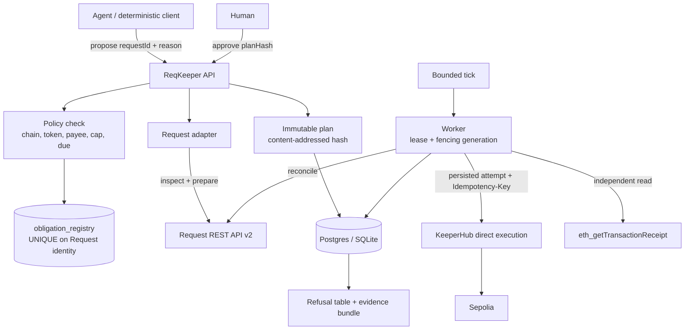

# ReqKeeper — Master Build Spec v3

**Event:** KeeperHub — The Agent Economy Hackathon (DoraHacks, id 2368)
**Deadline:** 2026-09-18 10:00 UTC (12:00 CEST). Internal freeze 2026-09-17.
**Written:** 2026-09-09.
**Budget:** $0. Testnet only. Solo.

This supersedes the ReqKeeper v2.0 spec. That document mandated 22 tables, 40+ API routes,
24 frontend routes and 20 doc files, and pre-committed to a target before checking whether
the target settles on a testnet for free. Most of it was scaffolding for a product with no users.

---

## 0. Evidence status

Anything below marked UNVERIFIED must be checked before it is depended on. Do not
launder an assumption into a fact by restating it.

### VERIFIED first-hand this session

| Fact | Evidence |
|---|---|
| `GET https://app.keeperhub.com/api/chains` is **public, no credential** | HTTP 200, 8037 bytes, unauthenticated curl |
| Ethereum Sepolia is live on KeeperHub | `{"chainId":11155111,"isEnabled":true,"isTestnet":true,"usePrivateMempoolRpc":true}` |
| 24 chains, all 24 `isEnabled`, 12 of them testnets | same response |
| `dashboard.request.network` has **no KYC / waitlist / email gate** | page renders exactly 3 buttons: `EVM`, `Tron`, `Connect Wallet` |
| Reference mp4 is a scroll capture of oryzo.ai | 18.633s, 1600x1000, 30fps, 559 frames, h264 High, yuv420p, 1.05 Mbps |
| HyperFrames can emit a raw frame sequence | `hyperframes-cli/references/preview-render.md`: `--format png-sequence` "writes RGBA frames to a directory" |
| Palette passes WCAG AA at worst case | computed relative luminance, worst text case 5.09:1 (floor 4.5) |

### VERIFIED by recon, primary-sourced, not re-checked by me

| Fact | Source |
|---|---|
| KeeperHub idempotency replay window is **24h, then the same key silently re-executes** | `docs.keeperhub.com/api/direct-execution` |
| KeeperHub free tier: 5,000 executions/mo, $1 gas credits, no card | `keeperhub.com/pricing` |
| Testnet usage is not metered | `docs/wallet-management/gas.md:97` |
| Default spend caps apply even to unconfigured orgs: 0.02 ETH/day EVM, $100/tx stablecoin | `docs/api/direct-execution` |
| `simulate: true` is EVM-only; Solana returns `simulation_unsupported_chain` | same |
| Request Network is **Sepolia-only** for testnets | `packages/currency/src/erc20/chains/sepolia.ts` |
| Sepolia `ERC20FeeProxy` = `0x399F5EE127ce7432E4921a61b8CF52b0af52cbfE` | `smart-contracts/src/lib/artifacts/ERC20FeeProxy/index.ts:150` |
| FAU token (18dp) = `0x370DE27fdb7D1Ff1e1BaA7D11c5820a324Cf623C` | `currency/src/erc20/chains/sepolia.ts` |
| FAU `mint(address,uint256)` is effectively public | 26 of last 50 txs to the contract are `mint`, from 7+ distinct senders |
| Repo requires an `accepted`-labelled issue **before** the PR; CI check `check-issue-link` enforces it | `ISSUES.md`, `CONTRIBUTING.md` |
| PR base branch is `staging`, title format `fix: #NNNN description` | same |

### UNVERIFIED — resolve on day 1

1. **Does Request's wallet sign-in actually issue a Client ID?** The gate is confirmed absent;
   the outcome of the signature is not. Owner action, ~60s.
2. **Do KeeperHub's default daily spend caps apply on testnet at all?** Docs say testnet gas
   is unmetered; silent on the value cap. If the 0.02 ETH cap applies to Sepolia, batch demos
   will hit it.
3. **Does Request waive its protocol fee on Sepolia?** Immaterial (worthless tokens) but it
   changes the exact approval amount, which the plan hash commits to.

### KNOWN-WRONG THINGS IN CIRCULATION

- The widely-repeated `ERC20FeeProxy = 0x370DE27f...` is **the FAU token address**, not the proxy.
- `docs.dreams.fun` and `router.daydreams.systems` do not resolve. "Daydreams" is now Lucid Agents.
- KeeperHub's docs page listing 9 chains **undercounts**; the live API returns 24, all enabled.
- caniuse claims Firefox 158 ships scroll-driven animations. Firefox stable is **155**; raw MDN BCD
  says `"version_added": "preview"` (Nightly only). No shipped Firefox has it.

---

## 1. Decision and thesis

**Target (the "live project"):** Request Network, on Ethereum Sepolia.
**Product:** exactly-once settlement of Request payment obligations through KeeperHub.
**Upstream fix:** a PR to KeeperHub fixing `#1959`/`#1929` — `?simulate=true` is ignored and the
transaction really executes.

### Thesis

> The seam between an agent and a signer has no exactly-once guarantee, and approvals do not
> bind to the bytes that execute.

Every layer says it is someone else's problem:

| Layer | Evidence | State |
|---|---|---|
| Wallet SDK | `coinbase/agentkit#1483` — "With no idempotency key, a retry is a second, independently valid transaction… Nothing in either response marks it as a duplicate." The key **already exists in the CDP SDK signature**; the one call path that moves value does not pass it. | open, filed 2026-09-04 |
| Agent framework | `crewAIInc/crewAI#5802` — `stripe.charge(amount, recipient)  # fires twice on retry` | open, 111 comments |
| Orchestrator | `langchain-ai/langgraph#7417` — tool calls >3min "silently re-dispatched from the last checkpoint while the original is still running" | open, 51 comments |
| Payment rail | `x402#452` — "the spec never states how facilitators must deal with duplicate requests". `x402#1805` — 5 concurrent requests, **4 got the same settlement proof**, duplicate debits refunded after the fact | open |
| **Execution layer** | **KeeperHub: replay lasts 24h, then "the stored response is gone and the same key executes again, silently"** | shipped behaviour |

KeeperHub owns reliability *within* a run. Nothing owns obligation identity *across* runs.

### Prior art, and the honest delta

Neither gate is novel. MetaMask's Delegation Framework ships both on-chain: `IdEnforcer.sol`
keeps a BitMap of used ids and reverts `require(!getIsUsed(...), "IdEnforcer:id-already-used")`;
`ExactCalldataEnforcer.sol` reverts unless `keccak256(termsCallData_) == keccak256(callData_)`.
Both require the payer to be an ERC-7710 delegator smart account.

**The delta:** this payer is a KeeperHub Turnkey EOA executing through a relayer/forwarder. No
delegator account exists to attach a caveat to, and there is no per-obligation on-chain
provisioning transaction to attach it in — so both enforcers are unavailable and both gates are
rebuilt off-chain in front of dispatch. Weaker, and therefore has to be reproducible. Say this in
the README rather than pretending the framework does not exist.

"Approved bytes are not signed bytes" is likewise named prior art: WYSIWYS (EF clear-signing post,
May 2026), ERC-7730, arXiv 2606.02668 for the agent approval channel, Checkmarx
"Lies-in-the-Loop" for the exploit, `experimental_toolApprovalSecret` in the Vercel AI SDK for a
shipped fix. **What is not covered by any of them:** clear signing assumes the human reads the
fields correctly and the *display* is under attack. Here the encoder is downstream of the display
— KeeperHub re-encodes server-side from `(contractAddress, functionName, functionArgs)` — so
nothing the human saw is what gets signed. That is the contribution. OWASP LLM06 never mentions
approval-versus-execution divergence, and the agentic threat list dropped the human channel (T10)
as an HCI/process concern rather than an agent-logic one.

KeeperHub published the thesis itself in March 2026 — signers "saw a routine transfer", actually
signed a `delegatecall` — and prescribed **monitoring**. An alert is a race; a byte comparison
before dispatch is not.

### Duplicates that actually cost money

Bug trackers show the mechanism; these show the loss. Lead the README with these.

| Case | Loss |
|---|---|
| ICON Network, 27 Aug 2026 | 2 signed withdrawal messages replayed 1,492 times (1,490 succeeded), 119,866,000 ICX released. Verbatim: "the uniqueness check (the guard meant to stop a message from being processed twice) only validated the high bits of the serial number." |
| City of Richmond auditor, 11 May 2026 | 50 duplicates, $5,759,563.64; largest a single $5,092,722.08 wire processed twice; three voided duplicates auto-reissued the same day. |
| UK Cabinet Office NFI 2022-24 | 819 duplicate payments worth £11m. |

The 24-hour ceiling is an industry pattern, not a KeeperHub bug: Stripe's own docs say keys "may be
pruned after 24 hours" and "We generate a new request if a key is reused after the original is
pruned."

**Market claim, inverted.** There is no public case of an AI agent making a duplicate payment, and
the README must not imply one. The honest claim is that agents are kept out of accounts payable
*because* nothing at this seam proves exactly-once: PwC finds 20% of executives would trust agents
with financial transactions, and on the Finch benchmark GPT-5.1 Pro passes 38.4% of finance
workflows. (The Lobstar Wilde $441,780 incident is a **decimals** error, not a duplicate — see the
DECIMALS HAZARD note in §9. Never cite it as duplicate evidence.)

### Why Request Network specifically

**The invoice is the idempotency key.** Every Request invoice carries a canonical request ID and
a 16-character payment reference embedded in the calldata. That is a stable obligation identity
issued by an external system, surviving process restarts, key rotation, and the 24h replay
expiry. Do not invent an identity scheme — Request already ships one.

And the loop closes without fabrication: pay with the reference embedded, and **Request's own
payment detection flips the invoice to paid**. Two independent systems confirming each other is
evidence that does not rest on this codebase's own reporting.

### Why not the alternatives

| Candidate | Killed by |
|---|---|
| Wayfinder | All 13 chains mainnet. Only sim is an ephemeral fork with no public explorer link, so **there is no verifiable public transaction**. Publishing a Path bonds 10,300 PROMPT. |
| Almanak | 19 chains, all mainnet. Local Anvil fork = no public tx hash. |
| Daydreams | Does not exist under that name any more. |
| Superfluid / Aave / Uniswap / Safe / Chainlink | KeeperHub plugins already exist. Safe's is **read-only**; Aave's is **mainnet-only despite Aave having a real Sepolia market**. |
| Compound v3, 0xSplits, LlamaPay | No usable testnet. |

**Fallbacks if Gate A fails:** Sablier (verified on both Sepolia and Base Sepolia, both with live
UI pages to film) or Circle CCTP V2 (two chains, two tx hashes, permissionless faucet, no signup).

### Honest framing

Invoice auto-payment was **not** in the top 12 pain points found in the evidence sweep. The *seam*
is the pain; Request is chosen because the obligation identity and the settlement evidence are both
already there. **This is exactly-once execution proven on invoices — it is not invoicing software.**

---

## 2. Scope

### Build

- Import a Request invoice by request ID → persist canonical obligation identity
- Deterministic policy: chain, token, payee allowlist, per-tx cap, due date
- Immutable payment plan, content-addressed by hash
- Human approval bound to the plan hash + a human-readable restatement
- Execute allowance + payment steps through KeeperHub, one durable attempt per step
- Verify the effect onchain (`receiptStatus`, effective payer, token, amount, reference)
- Reconcile against Request's own payment state
- Refuse: duplicate, expired plan, mutated plan, over-cap, non-allowlisted payee, already-paid
- One page. One refusal table. One evidence bundle per settlement.

### Do not build

Multi-tenancy. Workspaces. Roles. Invitations. OAuth sign-in. Budget reservation tables.
Evidence-bundle metadata tables. `/privacy`, `/security`, `/help` routes. Batch payments.
Partial settlement. Mainnet. Recurring payroll.

Rationale: this is a single-operator deployment. Multi-tenancy is the single largest time sink
here and buys nothing for one operator. The v2 spec even said "do not populate navigation with dead
modules" and then mandated dead modules.

### Deliberately kept despite being expensive

Plan hashing, the obligation registry, worker fencing, and the crash-window tests. These are the
exactly-once guarantee itself; everything else is packaging around them.

---

## 3. System map



**Boundaries that must hold:**

- The browser never holds the `kh_` key, never decides policy, never marks anything paid.
- The agent may propose an *existing authorised* obligation and read status. It cannot supply
  amount, recipient, chain, token, calldata, or an approval. Unknown authority-bearing fields are
  **rejected**, not ignored.
- Chain reads are independent evidence. A provider status string is not proof.
- KeeperHub is the only execution path. There is no hidden direct-wallet fallback.

---

## 4. Data model

Six tables. UUID ids, UTC timestamps, explicit row version. **Amounts are integer base units
stored as `numeric(78,0)` or lossless decimal text — `bigint` cannot hold all `uint256` values,
and JSON money fields are decimal strings, never floats.**

| Table | Purpose |
|---|---|
| `obligations` | Canonical Request identity + **UNIQUE constraint** = the whole duplicate defence. Holds source facts snapshot + hash. |
| `plans` | Immutable versioned plan, `plan_hash`, `policy_hash`, `source_facts_hash`, ordered steps, fees, expiry. |
| `approvals` | Approver, `plan_hash` approved, restatement text shown, decision, reason, timestamp. |
| `attempts` | One row per dispatch. Persisted provider body, endpoint, `idempotency_key`, `first_send_at`, outcome. Written **and committed before** any outbound call. |
| `jobs` | kind, unique dedupe key, `due_at`, attempts, `lease_expires_at`, `fencing_generation`, last error code. Claimed with `FOR UPDATE SKIP LOCKED`. |
| `audit` | Append-only. actor, action, object, correlation id. Tamper-**evident**, not tamper-proof — same DBA can rewrite it. Say so. |

### Canonical obligation identity

```
obligation_id = sha256( request_network_namespace || ':' || canonical_request_id )
```

Follow Request's own ID canonicalisation. Do not blindly lowercase. A `UNIQUE` index on this is
the mechanism. Changing payer wallet, rotating the API key, or regenerating calldata **must not**
mint a new identity.

**Guarantee, stated exactly:** prevents a second successful payment of the same canonical Request
obligation *through this deployment*. It cannot stop an independent wallet, another deployment, or
a human paying the same invoice out of band. Two different request IDs may also represent the same
real-world invoice; this release does not deduplicate across those. Put this in the README, not
just here.

---

## 5. Routes

Five. Anything else is dead navigation.

| Route | Contents |
|---|---|
| `/` | Inbox: obligations with state, amount, payee, last-checked timestamp. Import by request ID. |
| `/o/:id` | Obligation detail: source facts vs ReqKeeper annotations, current plan, permitted next action. |
| `/o/:id/approve` | Immutable plan: exact recipient (full address inspectable), token contract, invoice amount, every fee, **total debit**, allowance side-effect and residual, policy verdict, staged simulation state, expiry. Confirmation button carries the amount and token in its label. |
| `/o/:id/evidence` | Four separated layers: approved intent, provider observation, **independently verified chain effect**, Request reconciliation. Mode badge: `LIVE_TESTNET` / `FIXTURE` / `RECORDED_LIVE`. |
| `/refusals` | The refusal table. See §8. |

Render invoice descriptions as **inert text**. No HTML, no remote images, no following URLs from
an invoice field. Imported payment metadata is untrusted content.

---

## 6. The exactly-once contract

This is the product. Everything else is packaging.

### State machine

```
IMPORTED → VALIDATING → AWAITING_APPROVAL → APPROVED
        → ALLOWANCE_EXECUTING → PAYMENT_PREFLIGHT → PAYMENT_EXECUTING
        → CHAIN_PENDING → CHAIN_CONFIRMED → RECONCILING → SETTLED
```

Terminal / explicit refusal states — each one is a row in the refusal table:

`POLICY_DENIED` · `PAYEE_NOT_ALLOWED` · `LIMIT_EXCEEDED` · `SOURCE_ALREADY_PAID`
`OBLIGATION_RESERVED` · `PLAN_EXPIRED` · `PLAN_CHANGED` · `CALLDATA_MISMATCH`
`SIMULATION_BLOCKED` · `EXECUTION_OUTCOME_UNKNOWN` · `EXECUTION_REVERTED`
`RECONCILIATION_PENDING` · `EVIDENCE_CONFLICT`

`CHAIN_CONFIRMED` is **not** `SETTLED`. "Request says paid, chain evidence unresolved" is **not**
`SETTLED` either.

### Dispatch protocol

1. Lock the obligation row. Re-check policy, approval, `plan_hash`, expiry, source state.
2. Reserve the obligation transactionally.
3. Persist the attempt: exact provider body, endpoint, stable step identity, `Idempotency-Key`.
4. **Commit.** Insert the job in the same transaction (transactional outbox).
5. Claim a worker lease with a monotonically increasing fencing generation.
6. Confirm this worker still owns the recorded attempt.
7. Send.
8. Observe and reconcile through durable jobs.

The commit at step 4 is the local authority boundary. A policy change after it may not stop
in-flight remote work — never promise instant cancellation.

### Idempotency key derivation

```
idempotency_key = sha256( obligation_id || plan_hash || step_index )
```

Derived from persisted state only. **No timestamp, no random, no model-generated text.** Retrying
the same attempt reuses the identical key. A new key is only ever minted for a genuinely new
approved plan.

### The three holes this defends against

| Hole | KeeperHub behaviour | ReqKeeper defence |
|---|---|---|
| Replay expiry | key expires at 24h, same key silently re-executes | `UNIQUE` obligation registry outlives the window; refuse regardless of provider cache |
| `#1840` | reused key replays a **cached failure**, so retry can never succeed | distinguish "provider cached a failure" from "obligation unpaid"; require a new approved plan, never a key rotation |
| `#1959` / `#1929` | `?simulate=true` **ignored, transaction really executes** on the transfer route | never trust `simulate` as a safety boundary; assert `wouldRevert`/`status:"simulated"` **and** that no tx hash was returned. If a hash comes back from a simulate call, that is `EVIDENCE_CONFLICT` — treat it as a real send |

That last row is why the bounty PR and the product are the same body of understanding.

### Allowance staging — be honest about it

A payment cannot simulate successfully before its allowance exists. So:

1. Simulate the allowance step.
2. Show payment preflight as **"waiting for allowance"** — not as passed.
3. Human approves the staged plan **including the allowance side-effect and residual amount**.
4. Execute allowance. Confirm.
5. Re-check source facts, policy, plan validity.
6. Simulate the payment *now*.
7. Broadcast only after its own successful simulation.

If step 6 fails, no payment is sent — but **the allowance already exists onchain**. Display that
exposure and offer an explicit revoke path. Do not say "nothing happened onchain".

Grant only the validated amount required for this plan including fees. **Never unlimited.** Do not
touch an unrelated pre-existing allowance without explicit authorisation.

---

## 7. Demo script

Three minutes. The refusals are the demo, not the happy path.

| # | Beat | What is shown |
|---|---|---|
| 1 | Real unpaid Request invoice | Request's own UI, unpaid |
| 2 | Agent proposes | restricted client, two tools only: `propose(requestId, reason)`, `status(id)` |
| 3 | Plan | exact payee, token contract, invoice amount, fees, **total debit**, allowance residual, policy verdict, expiry |
| 4 | Approve | button label carries amount + token |
| 5 | Execute | KeeperHub execution id, then the Sepolia Etherscan link |
| 6 | Independent verification | `eth_getTransactionReceipt` read side by side with Request flipping to **paid** |
| 7 | **Replay** | re-propose the same invoice → `OBLIGATION_RESERVED`, original hash shown, **no second payment** |
| 8 | **Clock past 24h** | replay again with the provider cache expired → still refused |
| 9 | **Mutated plan** | flip one base unit in the amount → `CALLDATA_MISMATCH` |
| 10 | **Over-cap** | invoice above policy cap → `LIMIT_EXCEEDED`, refused before any provider write |
| 11 | Limitation | state one real one out loud (see §12) |

Long waits may be edited with a visible "elapsed" label. Never imply instant finality.

---

## 8. The refusal-table harness

The refusal table is the primary evidence artifact: a machine-generated record of every case the
system is expected to refuse, what it actually did, and whether anything was sent. A correct
refusal that still burned gas is a failed refusal.

Build `scripts/harness.ts` to emit `docs/refusals.json` + a rendered table:

```
case_id | scenario | expected | actual | refused_before_provider_write | gas_burned | tx_hash | independently_verified | mode
```

Required cases: duplicate same-run · duplicate after simulated 24h expiry · mutated amount by one
base unit · mutated recipient · non-allowlisted payee · over-cap · expired plan · already-paid
source · unknown selector · concurrent double-propose · crash between commit and send · crash
after send before response · lease expiry mid-flight · provider 409 body conflict · reverted
receipt · unsupported token · unsupported chain.

**Every landed hash must be re-read via `eth_getTransactionReceipt` and the result recorded.**
Provider status text alone is not evidence. `gas_burned` for a correct refusal must be `0`.

Tag every row `LIVE_TESTNET` / `FIXTURE` / `RECORDED_LIVE`. Fault-injected rows carry
`faultInjected: true` and say where the fault went in. A Playwright network failure is **not** a
backend process crash — do not conflate them.

Report skipped or blocked cases as skipped. A suite where every live case silently skipped is not
a pass.

---

## 9. Gate A — do this before writing product code

The riskiest assumption is that a Request payment can land through KeeperHub on Sepolia at all.
Test it first. Everything built before this passes is waste if it fails.

**Owner actions (~60s each, cannot be delegated):**

1. `dashboard.request.network` → `EVM` → `Connect Wallet` → **burner wallet, never a funded one**.
   Copy the Client ID. It is a public identifier.
2. `app.keeperhub.com` → sign up (captcha-gated) → Turnkey wallet auto-provisions →
   Settings → Developer → copy the `kh_` key. **`.env` only. Never in chat, logs, or the repo.**
   This key can move funds.

**Funding:**

3. Sepolia ETH from a faucet (KeeperHub's sponsored gas is mainnet-only).
4. FAU: call `mint(address,uint256)` on `0x370DE27fdb7D1Ff1e1BaA7D11c5820a324Cf623C` from
   Etherscan's Write Contract tab. `value = 10000000000000000000000` for 10,000 FAU.

**The proof, in order:**

5. `GET /api/chains` → confirm `11155111` `isEnabled` (already verified public).
6. Create a Request invoice for FAU on Sepolia. Currency id `FAU-sepolia`.
7. Ask Request to prepare the payment → capture calldata, fees, payment reference.
8. Land it through KeeperHub's **generic `web3` Write Contract action** (arbitrary address,
   auto-fetched ABI, signs with the Turnkey wallet). Do not write a plugin yet.
9. `eth_getTransactionReceipt` → confirm `status: success` and the reference in the calldata.
10. Poll Request → confirm the invoice flipped to paid.

### Verified API contract (fetched 2026-09-09 from `docs.request.network/llms-full.txt`)

```
Base:  https://api.request.network/v2/
Auth:  x-api-key      (server — backend services, cron, trusted env)
       x-client-id    (browser — also requires an Origin header)
Limit: 300 req/min default on Client ID, scoped per Client ID + IP
```

**Create an invoice** — `POST /v2/request`

```json
{
  "payee": "0xBURNER_ADDRESS",
  "amount": "100",
  "invoiceCurrency": "USD",
  "paymentCurrency": "FAU-sepolia"
}
```

Required: `payee`, `amount`, `invoiceCurrency`, `paymentCurrency`.
Optional: `payer`, `reference`, `recurrence`, `feePercentage`, `feeAddress`, `customerInfo`.

Confirmed Sepolia currency ids: `FAU-sepolia` · `USDC-sepolia` · `DAI-sepolia` ·
`ETH-sepolia-sepolia`.

**DECIMALS HAZARD.** `amount` is a **human-readable string** (`"100"`), not base units. This is
exactly the Lobstar failure class ($4 intended, $441,780 sent, "a decimal misinterpretation between
human-readable units and onchain raw amounts"). The plan must commit **base units** to the hash and
**restate the human-readable figure** in the approval. Never let the two drift.

**Get payment calldata** — `GET /v2/request/{requestId}/pay`

```json
{
  "transactions": [
    { "data": "0x...", "to": "0xTokenAddress", "value": "0x0" }
  ],
  "metadata": {
    "stepsRequired": 2,
    "needsApproval": true,
    "approvalTransactionIndex": 0,
    "paymentTransactionIndex": 1,
    "protocolFee": { "percentage": "0.5", "address": "0x..." }
  }
}
```

This maps 1:1 onto the allowance staging in §6 — Request returns the approval and the payment as
one **ordered array with explicit indices**. `plan_steps` is that array, in that order. Do not
reorder, do not synthesise an approval Request did not ask for, and do not invent a
reset-to-zero step unless `needsApproval` says so.

`metadata.protocolFee` **must be read at runtime.** The docs say so explicitly: "Read the current
rate that applies to any payment from the `metadata.protocolFee` field" rather than hardcoding.
The plan hash commits to the fee that was actually quoted. An unrecognised fee address is a refusal.

**Reconcile** — `GET /v2/payments`

Requires at least one filter: `txHash`, `walletAddress`, `paymentReference`, `requestId`,
`reference`, `type`, `invoiceCurrency`, `paymentCurrency`. Filter by `requestId`.

```json
{ "payments": [ {
    "sourceTxHash": "0x...", "timestamp": "...", "fees": [ ... ],
    "request": {
      "requestId": "01e273ecc29d...",
      "paymentReference": "0xb3581f0b0f74cc61",
      "hasBeenPaid": true,
      "reference": "ORDER-..."
    } } ] }
```

`request.paymentReference` is the canonical anchor. `request.hasBeenPaid` is Request's own
settlement verdict — one of the two signals `SETTLED` requires. The other is an independent
`eth_getTransactionReceipt`.

**Doc conflict, unresolved — running system wins.** `docs.request.network/llms.txt` says a Client ID
is obtainable only "after a payment destination exists". `llms-full.txt` says the opposite: "No
prerequisite payment destination or payout route required… destinations/routes are optional." The
live dashboard states "Setting up a destination allows you to generate payment requests." Check for
a Developer / API / Client ID section first; only configure a destination if the credential is
genuinely unreachable without one.

**If 8 fails:** isolate the exact failing request, keep sanitised diagnostics, fix that boundary.
Do not substitute a plain transfer, a dummy contract, or a manually flipped status. Research one
supported alternative within Request x KeeperHub. If the composed path genuinely does not exist,
pivot to Sablier — and say plainly that Request was attempted and why it failed.

---

## 10. Nine-day order

| Day | Work | Gate |
|---|---|---|
| 1 | Gate A end to end | A real Sepolia hash, verified two ways |
| 2 | Obligation registry + plan hashing + policy. TDD — this is the money path. | Duplicate/mutation/cap tests red then green |
| 3 | Durable jobs, attempts, fencing, worker tick | Crash-window tests pass |
| 4 | KeeperHub adapter + independent chain verification + Request reconciliation | `SETTLED` only with both |
| 5 | Restricted agent surface (2 tools) + the 5 routes | Agent cannot approve or override |
| 6 | Refusal harness, all cases, `refusals.json` | 0 gas on every correct refusal |
| 7 | Landing page: frame pipeline + scroll hero | LCP is the H1, verified |
| 8 | Demo video (same HyperFrames composition → mp4). README. Limitations. | Docs match the build |
| 9 | Upstream PR for `#1959`/`#1929`. One refutation pass. | PR opened against `staging` |

**Freeze features after day 7.** Do not spend the last session adding batch payments.

Slippage rule: cut breadth, never cut Gate A, the registry, the refusal harness, or evidence honesty.

---

## 11. Landing page

### Technique — settled with measured numbers

**Canvas is not an LCP candidate.** Paint frames into `<canvas>` and LCP falls to the H1. Use an
`` hero instead and the 1600x1000 poster becomes LCP and loses. That single fact decides the
architecture.

Rejected, with reasons:

- **Scroll-scrubbed `<video>`** — seeks snap to keyframes. Locally measured on low-motion footage
  (x264 CRF 23, 1080p, 150 frames, `scenecut=0`): GOP 150 → 0.19 MB, GOP 5 → **3.77 MB (20x)**,
  GOP 1 → **12.88 MB (68x)**. The widely-repeated "~5x" figure comes from *high-motion* clips
  where inter-prediction was not helping anyway. A hero push-in is exactly the worst case.
  `requestVideoFrameCallback` (95.38%) reports which frame *presented* — it does not make seeking
  frame-accurate.
- **WebCodecs** — needs a demuxer (100–300 KB+) before a pixel renders, manual `VideoFrame.close()`
  or the tab dies, and `ImageDecoder` is `preview`-only in Safari. Whole ecosystem is
  video-editor-shaped; no scroll-scrub demo exists in any of their galleries.
- **three.js** — ~150 KB+ gzipped before scene code, for footage already pre-rendered. Backwards.
- **GSAP ScrollTrigger** — now genuinely free for commercial use (all ex-Club plugins included).
  But measured from `gsap@3.15.0/dist/`: core **28,268 B gzip** + ScrollTrigger **17,998 B** =
  **~46 kB gzip**, not the ~35 kB I first quoted. Skipped: `position: sticky` + one
  `IntersectionObserver` does one pinned hero in ~40 lines. Note it is **not MIT** — GitHub reports
  `license: null`; it is a Webflow agreement they may amend or terminate.

**Chosen: scroll-scrubbed AVIF sequence → `<canvas>` + `drawImage`.** ~1.5 KB of own JS.

### Budget

120 frames, not 559. That is 3 deg/frame — past the premium turntable tier, and Apple ships 148.

| Tier | Config | Transfer | Peak decoded |
|---|---|---|---|
| Desktop >=1024px | 120 @ 1280x800 AVIF | ~1.84 MB | ~100 MB windowed |
| Tablet | 90 @ 960x600 | ~0.78 MB | ~55 MB |
| Mobile <768px | 48 @ 720x450 | ~0.23 MB | 62 MB, no windowing |
| reduced-motion / saveData / 2G | 1 frame | ~16 KB | 4 MB |

**The trap that kills mobile:** decoded RGBA is `w*h*4` regardless of file format. 120 frames at
1280x800 fully decoded is **492 MB** against iOS Safari's ~224 MB canvas memory cap and its
16,777,216 px area cap. Guaranteed crash. Mitigation: keep every 8th frame permanently resident
(15 frames, ~61 MB) as a coarse layer, plus a +/-8 frame window around the cursor, closing bitmaps
outside it via `ImageBitmap.close()`. Peak ~100 MB.

Per-frame byte figures are **derived from a 0.12 bpp assumption**, not measured on this footage.
Encode 5 real frames at AVIF q45/q50/q55 and re-run the table before committing. Dark smooth
gradients band and may force a higher bpp.

### Loading

LCP = the H1. Then: inline a ~2–3 KB 320x200 AVIF of frame 1 as a `data:` URI (needs
`img-src 'self' data:`) drawn on first paint so the hero is never empty → preload frame 1 full-res
→ start the sequence **only after LCP paints**, gated on not-reduced-motion, not `saveData`,
`effectiveType` not 2g → progressive halving: every 8th (15 files, ~230 KB) → 4th → 2nd → all.

**Interactive after ~230 KB, not 1.84 MB.** Frame lookup is "nearest loaded index".

`await img.decode()` before admitting a frame to the pool. A synchronous decode inside a scroll
handler is the classic 200 ms hitch people blame on the scroll library.

No spinner. If frames never arrive, the poster stays and the pinned section collapses after 6s.

### prefers-reduced-motion

Not "disable the animation" — that leaves three empty screens of spacer.

Unpin (`sticky` → `static`), **remove the 300vh spacer** so the section gets shorter, and replace
the canvas with three static frames at the narrative beats (index 0, ~60, ~119) inline above their
copy blocks as ordinary `` with explicit dimensions. Same information, no motion. Never fetch
the sequence. Keep opacity transitions — reduced *motion*, not reduced *change*. Re-evaluate on
`mql.addEventListener('change')`; users toggle mid-session.

### Frame pipeline

One HyperFrames composition, two deliverables:

```bash
npx hyperframes render --format png-sequence            # → scroll-scrub frames
npx hyperframes render --format mp4 --quality high      # → required submission video
```

Render the object on **transparent** background; paint `--canvas` in CSS. Palette stays retunable
without re-rendering and flat alpha regions compress far harder.

HyperFrames gotchas, from the skill contract:
- `three` adapter has **no duration auto-inference**. Omit `data-duration` on the root and it hard
  fails with "Composition has zero duration".
- Root needs an explicit pixel-sized box or content silently collapses to the top-left.
- Never pair a CSS initial `transform` with a GSAP tween on the same property — lint rejects it.
- A lint **error** silently switches off the layout and contrast audits; `check` then reports
  "0 samples", which reads clean but means nothing ran.

### Palette — verified, not guessed

Tuned to ORYZO's **measured** luminance steps (surface 1.35:1, hairline 1.70:1).

```css
:root{
  --canvas:#040806;      /* green-tinted near-black, not neutral */
  --surface:#1A2B1D;     /* step 1.35:1 vs canvas — matches ORYZO exactly */
  --hairline:#283C2B;    /* 1.70:1 — matches ORYZO exactly */
  --mid:#4C6351;         /* 3.08:1 */
  --text:#E6F7E8;        /* 18.07:1 canvas / 13.38:1 surface — AAA */
  --text-2:#93AC98;      /*  8.24:1 /  6.11:1 — AA */
  --text-muted:#879C8B;  /*  6.87:1 /  5.09:1 — AA, worst case, +0.59 margin */
  --signal:#3BFF6C;      /* 15.07:1 / 11.16:1 — AAA */
}
```

Two defects the maths caught that eyeballing would have shipped: `text-muted` was **4.21:1 on
surface, a fail**; and the first canvas→surface step was **1.12:1, nearly invisible** — fatal in a
system that bans drop shadows, because that step *is* the entire depth model.

Consider switching the secondary ramp to **translucent tinted white over canvas** instead of flat
hexes — terminal.shop measures `rgba(229,242,255,0.47)` for body copy, and the low-alpha tint is
what reads as phosphor rather than "grey text". Re-verify AA on the composited values first.

**Accent discipline:** ORYZO's ember measures only **4.88:1** against its canvas — that orange is
a *whisper*, which is why their own rules forbid it on buttons. `--signal` at 15:1 is far louder,
so it must be rarer than theirs or it dominates every screen.

### Motion contract, from the reference capture

| Scroll | Beat |
|---|---|
| 0–15% | Full-bleed photographic hero, object in context. Massive wordmark upper-left, micro-caps tagline above, fixed 4-item nav upper-right, vertical serial label right edge, translucent info card lower-left |
| 15–40% | Photo gone. Object detaches into the void, rotating to 3/4. Heading left column, body right column |
| 40–75% | Object keeps rotating, held by a hand rising from the bottom. Display line centred top, accent sub-label beneath |
| 75–100% | Rim-glow creeps in from screen edges on hover. Micro-legal in corner |

Devices with verified precedent (all measured off live DOM):

| Device | Precedent | Spec |
|---|---|---|
| vertical serial label | oxide.computer `FIG. 1 —` plate | 11px uppercase mono, 0.64px tracking, right edge of hero |
| micro-legal footnote | darkroom.engineering numbered columns | **8.9px** uppercase mono, weight 200, under a **177px** headline |
| display wordmark | darkroom "Therma" | 177px uppercase, -8.9px tracking, justified edge to edge |
| off-black + variable weight | linear.app | `#08090A`, weight **510**, -0.022em |
| loading state | lusion.co (the studio ORYZO credits) | oversized `00%` flush bottom-left, **clipped by the viewport edge** |

**Note:** the refero-extracted style doc says "never lowercase for headings". The actual site sets
its 40–75% display line in **mixed case**. Do not inherit that constraint.

Firefox has **no** scroll-driven CSS in any shipped version (stable is 155; raw MDN BCD says
`preview` = Nightly only). Author the no-support state as the default inside
`@supports (animation-timeline: scroll())`. Also: **scrolling does not count toward INP** — but
long tasks during scroll become input delay for the next real click, and Chrome does not score
scroll smoothness at all. Passing CWV is not evidence the hero is smooth.

Do not intercept wheel or touch events. `position: sticky` + native scroll keeps momentum,
PageDown, spacebar, find-in-page and screen readers working; only *read* the position. NN/g found
most participants were at least mildly disoriented by scrolljacking and some tried to refresh.

---

## 12. Known limitations — publish these

These belong in the README, stated plainly, not folded into a disclaimer nobody reads.

1. **Duplicate protection is deployment-scoped.** Prevents a second successful payment of the same
   canonical Request obligation through this deployment. Cannot stop an independent wallet, another
   deployment, or a human paying out of band.
2. **No semantic dedup across request IDs.** Two different Request IDs may represent the same
   real-world invoice. Not detected.
3. **Revocation is not an onchain undo.** Already-broadcast work completes. Cancellation only stops
   unsent actions.
4. **The audit chain is tamper-evident, not tamper-proof.** The same database administrator can
   rewrite it. It is not blockchain evidence.
5. **`simulate` is not a safety boundary on KeeperHub today** (`#1959`/`#1929`). ReqKeeper asserts
   around it; it does not fix the platform. The bounty PR does.
6. **Restored-backup hazard.** A restored older database can forget broadcasts that happened after
   the backup. Restored environments start with writes **disabled** pending reconciliation.
7. **Sepolia only.** Request supports no other testnet. Untested on mainnet, by design.
8. **Single-operator mode.** The owner reviews their own proposal, and it is labelled as such. An
   agent credential can never approve in any mode.
9. **No injection detection.** A guarded signer enforces a declarative policy. It does not detect
   prompt injection — do not claim it does.
10. **Approval fatigue is real and not solved here.** Measured over 11,429 reviews / 7 months:
    approval rate drifted 30.1% → 36.8% while inline comments fell 22% (p=0.0014). This design
    reduces prompt *count* (one approval per policy, escalate only on objective risk lanes: novel
    recipient, value band, allowance-vs-transfer) rather than pretending a per-action queue is safe.

---

## 13. Master prompt for the coding agent

Paste from here down.

---

You are the engineer for ReqKeeper. Build the product described in `docs/MASTER.md` in this repo.
The direction is decided. Do not restart ideation, do not substitute another hackathon idea, and
do not finish with a plan for someone else to implement.

**Priorities, in order. Higher beats lower, always.**

1. No unauthorised financial action, no leaked secret, no hidden mock execution presented as real.
2. A real Request Network obligation settled through KeeperHub on Sepolia, with independently read
   chain evidence and Request reconciliation.
3. Exactly-once behaviour demonstrated across duplicate, crash, and replay-expiry paths.
4. A complete refusal table with independently verified hashes and zero gas on correct refusals.
5. One page that another person can operate, in the specified palette.
6. Reproducible evidence, an honest README, a working demo video, and the upstream fix PR.

**Order of work.** Gate A (§9) first, completely, before any product code. If Gate A fails, stop
and report the exact failing request with sanitised diagnostics. Do not build around a broken
integration and do not substitute a plain transfer or a dummy contract for a real Request payment.

**Hard rules.**

- $0. No paid API, no card, no paid model calls, no paid domain. Testnet only. Mainnet is disabled.
- The `kh_` key lives in `.env`. Never in the repo, logs, analytics, error payloads, the frontend
  bundle, or a screenshot. It can move funds.
- Never approve a financial action while presenting yourself as the human reviewer. Automated
  approval tests live in isolated test mode and are labelled.
- Read before writing. Never edit a file based on its name or your memory of it.
- Amounts are integer base units in `numeric(78,0)` or lossless decimal text. Never `bigint`,
  never a float, never a JS number in a money field.
- The idempotency key is derived from persisted state only: `sha256(obligation_id || plan_hash ||
  step_index)`. No timestamp, no random, no generated text. Retry reuses the identical key.
- Persist and **commit** the attempt before any outbound call. Insert the job in the same
  transaction.
- Reject unknown authority-bearing fields on the agent surface — do not silently ignore them.
- `simulate: true` is not a safety boundary (`#1959`/`#1929`). Assert `wouldRevert` /
  `status:"simulated"` **and** that no transaction hash came back. A hash from a simulate call is
  `EVIDENCE_CONFLICT`; treat it as a real send.
- `SETTLED` requires both an independently read receipt and Request reconciliation. A provider
  status string is never sufficient.
- Never claim a test ran that did not run. Paste real output. If it fails, say so with the output.
- Every artifact is tagged `LIVE_TESTNET` / `FIXTURE` / `RECORDED_LIVE`. Never relabel a fixture
  as live.
- Render invoice descriptions as inert text. Never execute HTML, load remote images, or follow a
  URL from an invoice field. Imported metadata is untrusted.

**Toolchain — zero dependencies, verified on Node v24.12.0.** TypeScript runs directly via
strip-only type erasure (`node --experimental-strip-types`), tests via `node:test`, persistence
via `node:sqlite` (`DatabaseSync`). No bundler, no build step, no `node_modules`.

Strip-only mode erases types but never *emits* code, so this syntax is rejected at load with
`ERR_UNSUPPORTED_TYPESCRIPT_SYNTAX` — it bit the first file written:

- **constructor parameter properties** — `constructor(readonly code: X)`. Declare the field and
  assign it in the body instead.
- `enum` — use a union type plus a `const` object.
- `namespace` / `module` blocks, and `declare` with a body.

Erasable and fine: type annotations, `interface`, `type`, generics, `as`, `satisfies`, `readonly`
modifiers, class fields with initialisers, `import type`.

Also: `node --test test/` resolves the directory as a module and fails. Use bare
`node --experimental-strip-types --test` and let it auto-discover.

**Testing.** TDD for the money path only: obligation identity, plan hashing, policy, approval
binding, dispatch, recovery. Write the failing test first. Everything else gets one runnable check
that fails if the logic breaks. No frameworks-for-their-own-sake, no per-function suites.

Required crash-window coverage: crash before commit (no outbound effect), crash after commit
before send (job resumes the recorded attempt), crash during send with no response (unknown
outcome, reconcile, never a fresh payment), lease expiry mid-flight, provider 409 body conflict
(integrity failure — never rotate the key to make it succeed), replay window expired (no blind
resubmission).

**Laziness rules.** Stop at the first solution that holds. No interface with one implementation,
no factory for one product, no config for a value that never changes. Six tables, five routes, one
page. Reuse Request's payment reference as the identity — do not invent an identity scheme.
Deletion over addition. Mark any deliberate corner-cut with a `ponytail:` comment naming the
ceiling and the upgrade path.

**Reporting.** Lead with the outcome. Report failures plainly with actual output, skipped steps as
skipped. Never say "done" for something not exercised end to end. Type-checking passing is not
verification.

---

## 14. Source register

Recheck anything load-bearing at implementation time. Most architecture below is ReqKeeper design,
not a claim that upstream docs supply a solution.

| Ref | What | URL |
|---|---|---|
| S1 | KeeperHub MCP server, auth modes, tool inventory | `docs.keeperhub.com/agent/mcp-server` |
| S2 | Direct execution: payload shape, idempotency, 24h replay, simulate, receipts | `docs.keeperhub.com/api/direct-execution` |
| S3 | Live chain list — **public, no auth** | `app.keeperhub.com/api/chains` |
| S4 | Free tier | `keeperhub.com/pricing` |
| S5 | Contribution gate: `accepted` label, `staging` base, title format | `github.com/KeeperHub/keeperhub/blob/staging/ISSUES.md` |
| S6 | `simulate=true` ignored — the upstream fix target | `github.com/KeeperHub/keeperhub` issues `#1959`, `#1929` |
| S7 | Reused key replays a cached failure | same, `#1840` |
| S8 | Request API v2 endpoints + auth | `docs.request.network/api-reference/endpoints-overview` |
| S9 | Sepolia token + proxy addresses | `requestNetwork/packages/currency/src/erc20/chains/sepolia.ts` |
| S10 | `ERC20FeeProxy` Sepolia artifact | `requestNetwork/packages/smart-contracts/src/lib/artifacts/ERC20FeeProxy/index.ts` |
| S11 | Retry duplicates a money-moving call | `github.com/coinbase/agentkit/issues/1483` |
| S12 | Tool re-execution on retry | `github.com/crewAIInc/crewAI/issues/5802` |
| S13 | Silent re-dispatch after timeout | `github.com/langchain-ai/langgraph/issues/7417` |
| S14 | x402 duplicate-request semantics unspecified; live double-charge | `x402-foundation/x402` `#452`, `#1805` |
| S15 | Approval habituation, measured | arXiv 2606.22721 |
| S16 | Canvas is not an LCP candidate | `web.dev/articles/lcp` |
| S17 | iOS canvas memory + area caps | Apple Developer Forums thread 112218 |
| S18 | GSAP licence (free, not MIT, Webflow-authored) | `gsap.com/community/standard-license` |
| S19 | Scroll-driven animation support; Firefox is `preview` only | caniuse + raw MDN BCD |
| S20 | Scrolljacking usability findings | `nngroup.com/articles/scrolljacking-101` |
| S21 | HyperFrames render formats incl. `png-sequence` | `~/.claude/skills/hyperframes-cli/references/preview-render.md` |
| S22 | HyperFrames three adapter, `hf-seek`, duration requirement | `~/.claude/skills/hyperframes-animation/adapters/three.md` |
| S23 | MetaMask `IdEnforcer.sol` / `ExactCalldataEnforcer.sol` — the on-chain rival | `github.com/MetaMask/delegation-framework/tree/main/src/enforcers` |
| S24 | Caveat enforcers require an ERC-7710 delegator smart account | `docs.metamask.io/delegation-toolkit/concepts/delegation/caveat-enforcers/` |
| S25 | KeeperHub prescribes monitoring for the Bybit `delegatecall` class | `keeperhub.com/blog/003-bybit-attack-caught-by-wrong-people` |
| S26 | ICON replay: broken uniqueness check, 1,492 replays, 119,866,000 ICX | `icon.foundation/blog/2026/icon-network-replay-exploit-post-mortem` |
| S27 | City of Richmond: 50 duplicates, $5,759,563.64 | `rva.gov/sites/default/files/2026-05/OCA 2026-09 Continuous Monitoring - Duplicate Payments 5.11.26.pdf` |
| S28 | UK NFI 2022-24: 819 duplicates, £11m | `gov.uk/government/publications/national-fraud-initiative-reports/national-fraud-initiative-report-2022-2024-html` |
| S29 | Idempotency keys "may be pruned after 24 hours" — industry pattern | `docs.stripe.com/api/idempotent_requests` |
| S30 | WYSIWYS / clear signing; "billions in user losses, including the Bybit hack" | `blog.ethereum.org/2026/05/12/clear-signing-announcement` · ERC-7730 |
| S31 | Consent integrity bound "to the exact action that executes" | arXiv 2606.02668 · Checkmarx "Lies-in-the-Loop" · `ai-sdk.dev/docs/agents/tool-approvals` |
| S32 | 20% of executives would trust agents with financial transactions | `pwc.com/us/en/tech-effect/ai-analytics/ai-agent-survey.html` |
| S33 | Finch benchmark: GPT-5.1 Pro passes 38.4% of finance workflows | arXiv 2512.13168 |
